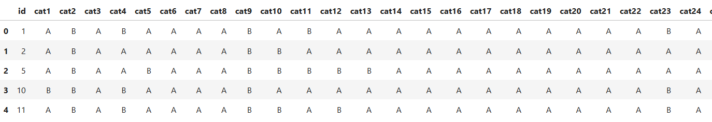
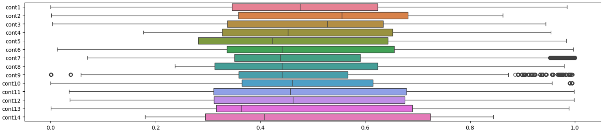
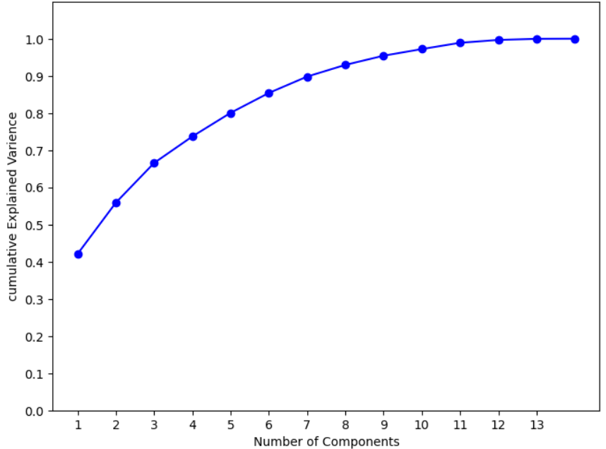
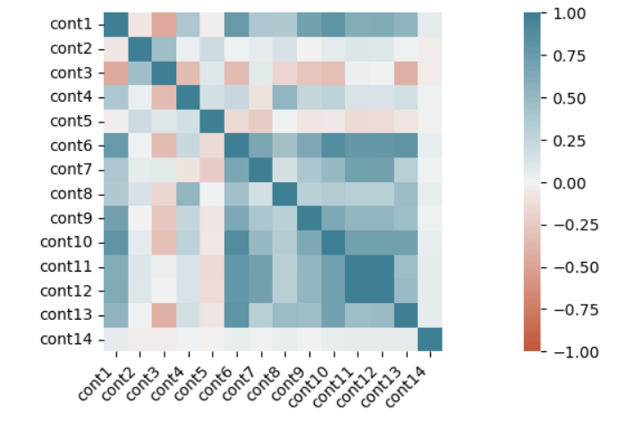
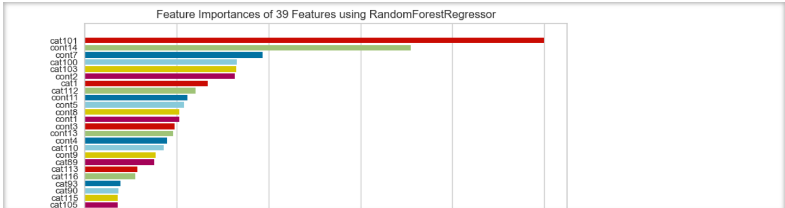

## Insurance Claim Severity Prediction

This project aims to predict the severity of insurance claims using machine learning and deep learning models. The model is trained on historical claim data to assist in determining the severity of future claims, improving resource allocation and reducing potential costs.


## Table of contents

- [Project Overview](#project-overview)
- [Data](#data)
- [Installation](#installation)
- [Data Preprocessing and Feature Engineering](#data-preprocessing-and-feature-engineering)
- [Feature Selection](#feature-selection)
- [Model Details](#model-details)
- [Results](#results)
- [Contributing](#contributing)
- [License](#license)


## Project Overview

The goal of this project is to leverage supervised machine learning and deep learning techniques to predict the severity of insurance claims based on a dataset of past claims. This can provide insights to insurance providers, helping them assess risk and allocate resources effectively.
## Data

The Dataset is taken from kaggle ,provided by 'AllState' a personal insurer in the United States . Each row in this dataset represents an insurance claim. You must predict the value for the 'loss' column. Variables prefaced with 'cat'(cat1,cat2..) are categorical, while those prefaced with 'cont'(cont1,cont2..) are continuous.



## Installation

1. Clone the repository:
   ```bash
   git clone https://github.com/rupankar-02/insurance-claim-severity.git
   cd insurance-claim-severity
## Data Preprocessing and Feature Engineering

### 1. Handling Missing Values

- **Imputation**: Missing values in numerical columns were handled using median or mean imputation, depending on the distribution of each feature. For categorical columns, missing values were filled with the mode (most frequent value).
- **Removal**: Columns with a high proportion of missing values (e.g., >50%) were dropped, as they did not provide sufficient information for model learning.

### 2. Encoding Categorical Variables

- **One-Hot Encoding**: Applied to categorical variables with a small number of unique categories, creating binary columns to prevent ordinal relationships.
- **Label Encoding**: Used for high-cardinality features (e.g., geographic regions), reducing dimensionality by assigning unique integers to each category.

### 3. Outlier Detection and Treatment

Outliers in numerical columns were identified and treated to prevent model distortion.

- **Z-Score Analysis**: Outliers were flagged using the Z-score method for data within ±3 standard deviations.
- **IQR Method**: For highly skewed features, the IQR method was used, capping or removing points beyond 1.5 times the IQR from the first and third quartiles.




### 4. Feature Scaling

- **Normalization**: Skewed features were normalized to a 0-1 range.
- **Standardization**: For normally distributed features, standardization (subtracting the mean and dividing by the standard deviation) was applied.

### 5. Feature Engineering

- **Polynomial Features**: Polynomial transformations were applied to selected numerical features to capture non-linear relationships.
- **Domain-Specific Features**: Created features such as:
  - **Claim Duration**: Calculated by subtracting the claim initiation date from the claim closure date.
  - **Age Group**: Grouped continuous age data into age brackets.
  - **Region Aggregation**: Aggregated claims from similar geographic regions to generate a regional severity metric.

### 6. Dimensionality Reduction

To prevent overfitting and reduce computational cost:

- **Principal Component Analysis (PCA)**: Used to retain the most informative features.
- **Variance Thresholding**: Low-variance features were removed to improve model focus on high-variance predictors.



### 7. Train-Test Split

The data was split into training and testing sets to validate model performance on unseen data.

- **Holdout Method**: An 80-20 split was used.
- **Stratification**: Applied to ensure that the target variable’s distribution was similar in both sets.
## Feature Selection

To improve model performance and reduce dimensionality, feature selection was applied:

- **Correlation Analysis**: A correlation matrix was used to identify highly correlated features. One feature from each highly correlated pair (correlation > 0.8) was removed to reduce multicollinearity.

- **Feature Importance from Tree-Based Models**: `RandomForestRegressor` and `GradientBoostingRegressor` were used to rank features by importance. Features with low importance were removed from the dataset.

- **Recursive Feature Elimination (RFE)**: RFE was applied to iteratively remove the least significant features until reaching an optimal subset, helping to confirm feature importance results.

- **Statistical Tests**: Chi-Squared tests were performed on categorical features to measure association with the target variable, discarding those with low statistical significance.

- **Variance Inflation Factor (VIF)**: VIF was calculated to detect multicollinearity. Features with high VIF scores (>10) were removed to reduce redundant information and improve model stability.

  




## Model Details

### Machine Learning Models

Algorithms like `RandomForestRegressor` and `GradientBoostingRegressor` were implemented to predict claim severity.

The models were evaluated using metrics such as Mean Squared Error (MSE) and R-Squared Score (R²).
## Results

The models were evaluated using the following metrics:

- **Mean Squared Error (MSE)** : RandomForest-0.65 , GBR-.70
  
- **R-Squared Score (R²)** : RandomForest-0.35 , GBR-0.25
## Contributing

Contributions are welcome! Please open an issue or submit a pull request.
## License

This project is licensed under the MIT License.
